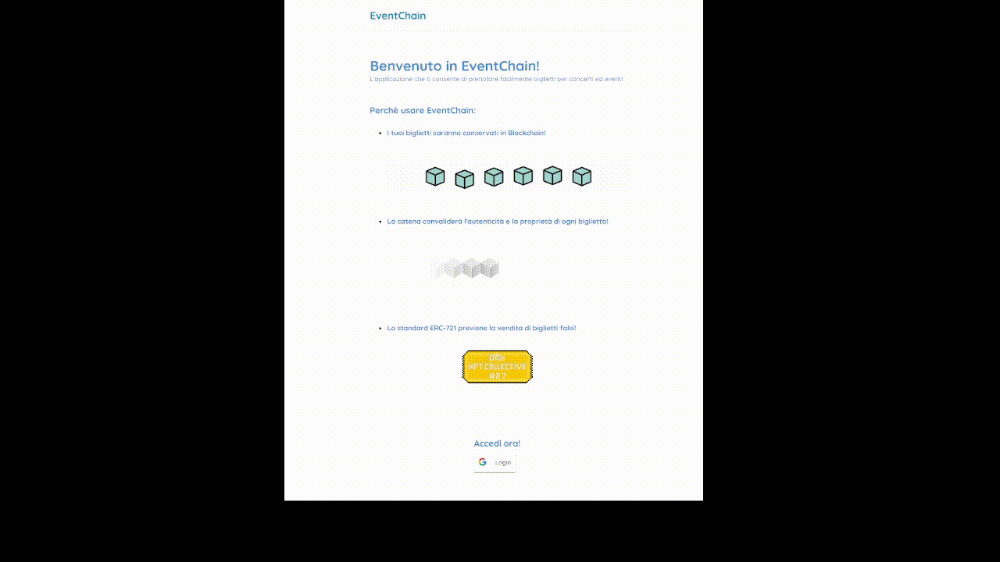

**EventChain** is an Ethereum blockchain-based online ticketing system to manage ticket reservation (NFT) for any event. Thanks to the nft (non-fungible token) standard, it is possible to track the owner of each ticket, as well as to prevent fake ticket scams, prevent theft, prevent reselling activities, and in general suspicious activities in ticket trading.

The application was developed in Java for the backend section, React for the frontend section, and Solidity for blockchain management.

Translated with DeepL.com (free version)

